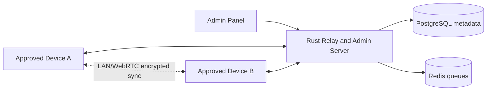

# Phase 1 Architecture and Folder Structure

## Architectural decisions

1. **Monorepo structure** keeps client, server, shared protocol assets, crypto specifications, infrastructure, deployment assets, tests, and documentation versioned together. This reduces protocol drift and makes security review easier.
2. **Flutter client with Clean Architecture** separates presentation, application state, domain use cases, and infrastructure adapters so cryptographic workflows can be tested independently from UI code.
3. **Rust server boundary** treats the backend as an authorization, relay, device registry, and synchronization service. It is intentionally not a message processor because message plaintext must remain inaccessible to infrastructure.
4. **Shared protocol directory** is reserved for schema definitions and wire-format documentation consumed by both the Flutter app and the Rust backend.
5. **Dedicated crypto directory** stores protocol specifications and test vectors separately from product code to simplify future independent cryptographic review.
6. **Documentation-first security workflow** records decisions, threat assumptions, and operational constraints before implementation begins.

## Target components

## Client layers

- `client/flutter_app/lib/app`: app bootstrap, routing, theming, and dependency registration.
- `client/flutter_app/lib/core`: platform security adapters, networking primitives, local database, and common errors.
- `client/flutter_app/lib/features`: feature modules for authentication, messaging, administration, and settings.
- `client/flutter_app/lib/shared`: reusable UI components and shared client utilities.

## Server modules

- `server/src/api`: WebSocket and administrative API entry points.
- `server/src/auth`: public-key challenge authentication and authorization gates.
- `server/src/crypto`: server-side verification helpers only; no private client-key handling.
- `server/src/messaging`: encrypted envelope relay and queue management.
- `server/src/admin`: approval, revocation, group management, invite generation, and server-key rotation.
- `server/src/relay`: connection management and future LAN/WebRTC signaling coordination.

## Security decisions

1. **No plaintext server processing**: server modules will handle encrypted envelopes and metadata needed for routing only.
2. **No password subsystem**: authentication will use public-key challenges tied to permanent device identities.
3. **Private-key locality**: client architecture reserves secure-storage adapters for Android Keystore, iOS Keychain/Secure Enclave where available, and desktop credential stores.
4. **Cryptography isolation**: Double Ratchet, X25519, Ed25519, HKDF, and AEAD choices will be specified under `crypto/` before product integration.
5. **Approval-first access control**: server authorization will reject all communication until an administrator approves the device identity.
6. **Minimal logs**: logging policy is defined before implementation to prevent accidental sensitive logging.

## Phase 1 completion criteria

- Scalable folder structure exists.
- Initial architecture documentation exists.
- Initial security baseline exists.
- Phase 2 is blocked pending explicit approval.
